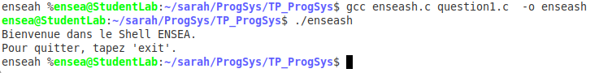
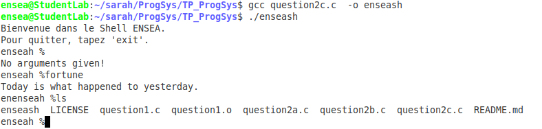
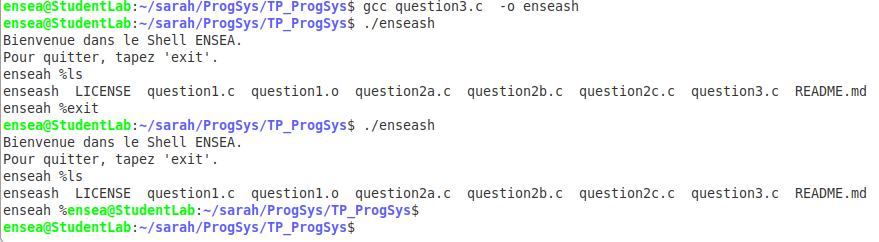

# TP_ProgSys
# Compte Rendu du TP de programmation Système

Par Sarah Mostafavi Gorji et Nada Sbai

## I. Introduction
L'objectif du TP est de réaliser un terminal fonctionnel qui doit afficher les codes de sorties des programmes lancés ainsi que leur durée de fonctionnement.

## II. Projet

On commence par créer le microshell enseash.c qui va permettre de lancer les commandes. 
On va y ajouter les fonctionnalités suivantes : 

### 1. Affichage du message d'accueil
L'objectif de cette fonctionnalité est de faire apparaître un message d'accueil indiquant qu'on a ouvert le microshell. On doit également ajouter un prompt qui doit permettre de donner l'apparence d'un terminal.
Pour afficher le message, on utilise le programme **write()** à qui on fournit 3 arguments qui dans l'ordre sont :
* **STDOUT_FILENO** : pour indiquer qu'on souhaite écrire le message en sortie, dans le terminal.
* **welcome_message** : le message de bienvenue sous forme de chaine de caractère.
* **Le nombre de caractères** du message de bienvenue à afficher.

On écrit également le prompt sous forme de chaine de caractère de la même manière que le message de bienvenue.

On teste ensuite le bon fonctionnement de ce programme. Pour cela, on le compile grâce au programme **gcc** dans le terminal.
Après la compilation, on exécute le programme en entrant **"./enseash"**. On observe bien le comportement attendu, à savoir le message de bienvenue et le prompt qui s'affichent :

Cependant à ce point du TP, le microshell ne peut rien faire d'autre. La prochaine étape est donc de lire les commandes entrées par l'utilisateur à la suite du prompt.

### 2. Exécution de la commande saisie et retour au prompt
On souhaite donc maintenant pouvoir executer les commandes saisies par l'utilisateur et retourner au prompt une fois qu'elles sont réalisées.

Pour cela, on décompose la réalisation de cette fonctionnalité en 3 parties : 
* Lecture de la commande saisie,
* Exécution d’une commande simple (sans argument),
* Retour au prompt enseash % et attente de la commande suivante. 

#### 2.a) Lecture de la commande saisie
Pour lire la commande saisie, on utilise la fonction **read()** qui permet de lire ce qu'on écrit dans le terminal grâce aux paramètres : 

* **STDIN_FILENO** : pour indiquer qu'on souhaite lire la chaine de caractère en entrée du terminal.
* **read_buffer** : le tableau dans lequel sera stockée la chaine de caractère en entrée. Elle est instanciée juste avant l'appel à la fonction **read**. On a choisi que sa taille maximale soit définie par la macro **READ_BUFFER_MAX_SIZE** de valeur 200 (cela permet d'être sur que la commande soit entière).
* **READ_BUFFER_MAX_SIZE** : ma taille maximale de la chaine de caractère en entrée. Cet argument permet de faire en sorte que la commande en entrée n'est pas plus de caractère que la taille du read_buffer.
On fait en sorte que le read renvoie la taille **n** de de la commande lue. Cette taille sera utile notamment pour trouver la nature de la commande.

#### 2.b)  Exécution d’une commande simple (sans argument)
On cherche maintenant à exécuter la commande lue. 

Pour cela, on utilise la fonction **execlp()** pour laquelle on met en argument : 

* **read_buffer** le tableau de caractères contenant la commande entrée.
* **read_buffer** le tableau de caractères contenant la commande entrée.
* La chaine de caractère vide : **(char *)NULL**.

Pour pouvoir utiliser **read_buffer** en entrée de execlp, on a besoin de le convertir en chaine de caractère et donc de remplacer son dernier caractère qui est le '\n' par '\0'.

Nous avons également ajouté la gestion du cas où aucune commande se trouve en entrée à la suite du prompt (i.e. le cas où l'utilisateur appuie sur "Entrée" directement à la suite du prompt). Ce cas correspond donc à une commande vide, à savoir le cas où le nombre de caractère en entrée n=1. Dans ce cas, on renvoie le message "No arguments given!\n" qui indique qu'aucune commande a été lancée.

Pour le moment, si on compile le code, on remarque que l'on ne peut pas retourner au prompt. On ne peut donc exécuter qu'une seule commande. On va donc par la suite chercher à revenir au prompt pour pouvoir en exécuter plusieurs.

#### 2.c)  Retour au prompt enseash % et attente de la commande suivante
On cherche donc à revenir au prompt. Pour l'instant, on ne peut pas revenir au prompt car l'appel à la fonction execlp termine le processus. 
Pour pallier à ce problème, on a donc besoin de dupliquer ce processus grâce à un **fork**. On réalise alors les étapes suivantes : 
* On vérifie que la création du fork se passe sans problème. s'il y a un problème, le pid = -1.
* Le **processus père** attend que le processus fils ait fini.
* Le **processus fils** exécute le **execlp**.

Le **fork** doit avoir lieu après la lecture de la commande avec la fonction **read**.

On souhaite donc maintenant que l'on puisse exécuter à l'infini les commandes. Pour cela, on mais l'ensemble des étapes décrites plus tôt dans une boucle infinie **while(1)**.

On vérifie ensuite le bon fonctionnement de l'ensemble du programme. Pour cela, on compile et éxecute le code. On teste alors l'exécution des commandes en entrant :
* "Entrée" directement après le prompt : on obtient bien le message défini.
* le programme **ls** qui affiche comme attendu la liste des fichiers contenus dans le répertoire de travail.
* le programme **fortune** qui permet d'obtenir un message aléatoire. Il nécéssite l'installation de la bibliotèque apt. On observe bien le comportement attendu.

### 3. Gestion de la sortie du shell avec la commande “exit” ou un <ctrl>+d
Pour l'instant, il est impossible de sortir du shell. On veut donc ajouter les commandes clasiques que sont **"exit"** et **"CTRL+d"** pour sortir du shell. 
On doit opérer à une opération de filtrage juste après la lecture de la commande.

En pratique, pour identifier que la commande est **"exit"** ou **"CTRL+d"**, on doit : 
* Pour **"exit"** : comparer la chaine de caractère contenue dans read_buffer avec **"exit"**. Pour cela, on utilise la fonction de comparaison de string **strcmp**.
* Pour **"CTRL+d"** : le read_buffer est vide, c'est-à-dire n = 0.

Dans les deux cas, on appelle la fonction exit. On veut que l'exit soit un succès, on utilise donc : **exit(EXIT_SUCCESS)**.

On obtient le résultat attendu :

## III. Conclusion
